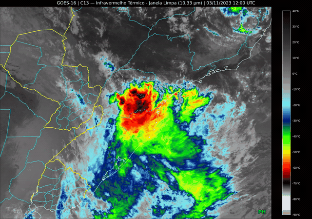
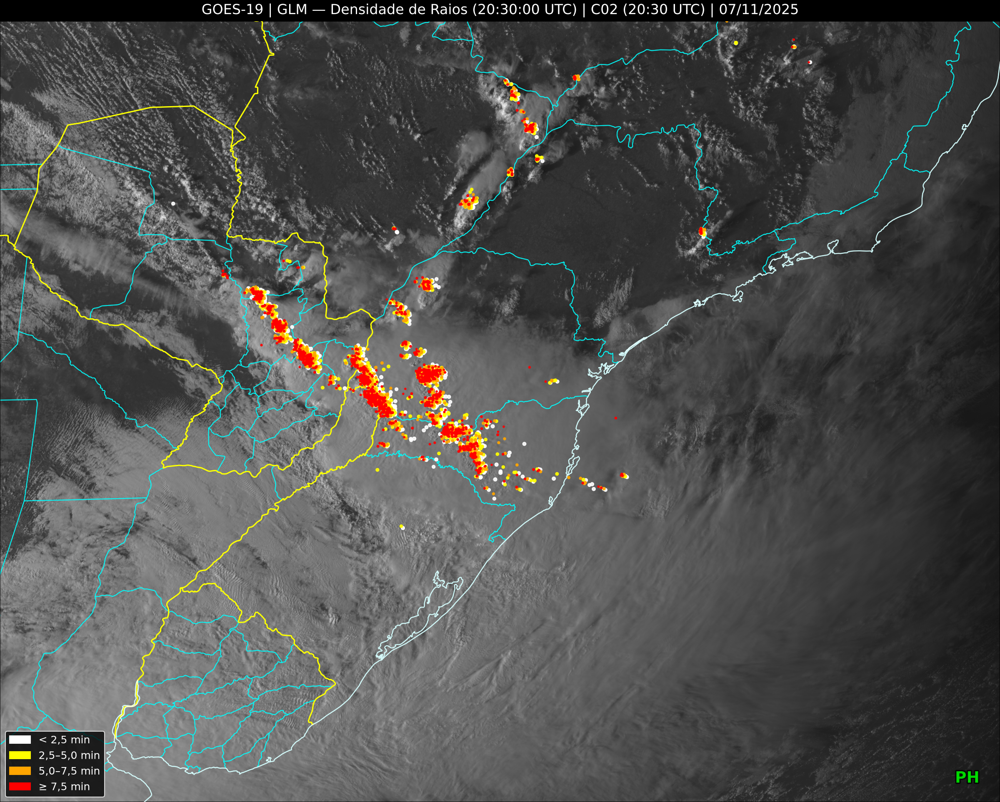
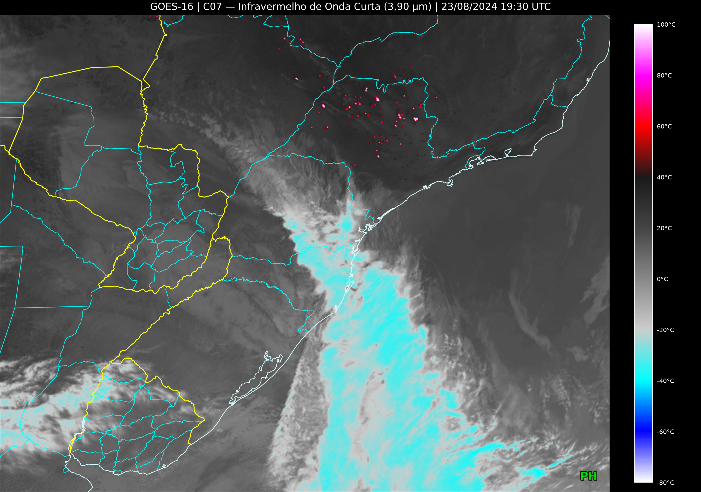
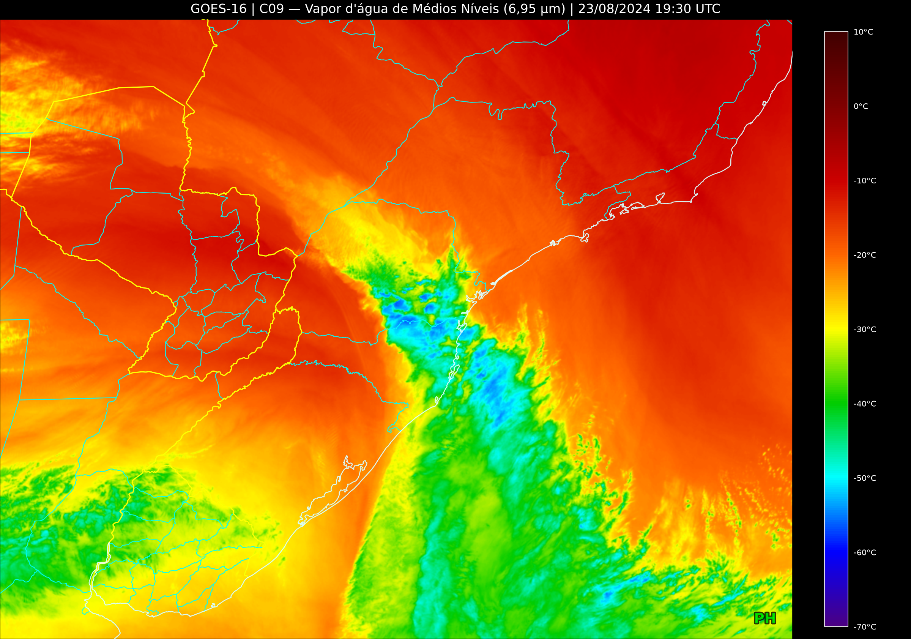

# GOES Image Generator

Gera imagens e vídeos a partir dos satélites GOES-16/GOES-19 (bandas ABI 1-16 e GLM), focado na América do Sul. Baixa os NetCDF direto do bucket público da NOAA na AWS (acesso anônimo, sem credenciais), recorta a região configurada, aplica as paletas de `colors.ini` e renderiza com matplotlib/cartopy. Dá pra gerar uma imagem única ou montar um vídeo com FFmpeg.

Toda a configuração (canal, período, mapa, cores, performance) fica em `config.ini` e `colors.ini`, com explicações sobre todos os parâmetros. Esse README basicamente cobre o que os `.ini` não explicam.

---

### Exemplo de Animação 

<p align="center">
  <br>
  <small><i>Animação GOES-16 Banda 13 Sem GLM (mostrado em GIF, logo qualidade reduzida)</i></small>
</p>

### Exemplos de Renderização

<table border="0" width="100%">
  <tr>
    <td align="center" width="33%">
      <b>Banda 2 (Visível) + GLM</b><br>
      <br>
      <small>Banda 2 com GLM</small>
    </td>
    <td align="center" width="33%">
      <b>Banda 7 (Infravermelho Curto)</b><br>
      <br>
      <small>Banda 7 sem GLM</small>
    </td>
    <td align="center" width="33%">
      <b>Banda 9 (Vapor d'Água)</b><br>
      <br>
      <small>Banda 9 sem GLM</small>
    </td>
  </tr>
</table>

---

## Instalando

Python 3.10+. Cartopy precisa de GEOS/PROJ instalados no sistema, então o caminho mais tranquilo é usar Conda:

```bash
git clone https://github.com/ArthurPH25/goes-image-generator.git
cd goes-image-generator
conda create -n goes python=3.11
conda activate goes
conda install -c conda-forge cartopy
pip install -r requirements.txt
```

Pip puro também funciona, mas instalar o Cartopy vira um problema à parte dependendo do sistema operacional. Resolve GEOS/PROJ antes de rodar o `pip install`.

O FFmpeg não precisa estar instalado nem no PATH: o `imageio-ffmpeg` (já vem no requirements) traz o próprio binário junto com o pacote. Roda em servidor sem tela sem precisar configurar nada, já que o `matplotlib.use("Agg")` fica forçado no topo dos módulos. Em servidor, use `open_video_when_done = False` no `config.ini` pra não tentar abrir o vídeo no fim.

A primeira execução precisa de internet pro mapa, pois o Cartopy baixa uma vez os dados de fronteiras, estados e costa (Natural Earth, escala 10m) e guarda no cache dele. O script faz esse download no processo principal, antes de disparar os workers. Nas execuções seguintes já está tudo local.

Ajuste `config.ini` e `colors.ini` na raiz do projeto (canal, data/hora, coordenadas do recorte, cores, número de processos etc) e rode:

```bash
python index.py
```

Pode rodar de qualquer diretório: os dois `.ini` são lidos da pasta do script (não aceita caminho por parâmetro) e todas as pastas de saída e temporárias também ficam dentro da pasta do projeto. Valida tudo antes de baixar qualquer coisa, então se a execução morrer rápido é porque tem algo errado no `.ini`, e a mensagem diz o quê. No final imprime tempo de execução e avisos/erros no terminal, e no modo vídeo tenta abrir o resultado no player padrão do sistema (desligável em `open_video_when_done`).

## O que o projeto suporta (e o que não)

- Só ABI Full Disk (disco completo), produto `ABI-L2-CMIPF`, com uma imagem a cada 10 minutos, no modo de escaneamento 6. Períodos em que o satélite operava em outro modo (o GOES-16 só passou ao modo 6 por volta de abril de 2019) não são encontrados no bucket. CONUS e mesoescala não são suportados.
- GLM (`GLM-L2-LCFA`): um arquivo a cada 20 segundos.
- Troca automática de satélite: antes de 2025-04-07 15:10 UTC usa o GOES-16; a partir daí, o GOES-19. Esse horário é o da transição operacional divulgada pelo NWS, então frames muito próximos dele podem não existir (imagem única falha com erro claro, vídeo pula o frame).
- Canais 1 a 6 (refletância) saem sempre em cinza; só os canais 7 a 16 e o GLM têm paleta editável em `colors.ini`.

## Como funciona por dentro

A validação de `config.ini`/`colors.ini` roda logo no início do `index.py`, antes de qualquer coisa tocar rede. Nessa etapa também é calculada a `render_signature`, um SHA1 de 12 caracteres com tudo que muda a aparência do frame: canal, `[MAP]`, `[STYLE]` inteiro, dpi, fundo do GLM e as paletas do canal ativo. Data e horário ficam de fora dessa assinatura de propósito.

Essa assinatura define a pasta `satelite_temp_images/<assinatura>/` no modo vídeo. Mudar só o período reaproveita os frames já renderizados (desde que a pasta ainda exista: com `delete_temp_images = True` ela é apagada assim que o vídeo é montado, e só sobra se a execução for interrompida antes), mudar qualquer coisa visual gera uma pasta nova. No modo imagem única isso nem entra em jogo, a saída vai direto pra `satelite_images/`.

A busca no S3 roda sequencial, fora dos processos de renderização: listagens do bucket por hora de dados (o s3fs reaproveita listagens já feitas na mesma execução), mais as da pasta ABI se `glm_background_band` estiver setado. Sem paralelismo aqui de propósito, listar já é rápido e paralelizar só aumenta a chance de bloqueio por parte da NOAA logo no começo.

Antes de disparar os processos, o processo principal garante que os dados de mapa do Cartopy estejam em cache, pra que os workers não tentem baixar os mesmos arquivos ao mesmo tempo na primeira execução.

A renderização distribui cada timestamp entre `num_workers` processos separados. Dentro de cada um:

- baixa o NetCDF principal (`S3_downloader.download_batch`, assíncrono, com validação do arquivo, retentativas e backoff). Cada worker baixa o próprio arquivo, então `num_workers` é também o número de downloads simultâneos do arquivo principal
- renderiza com matplotlib/cartopy (`goes_bands.py` ou `GLM.py`)

No canal GLM o processo ainda busca o histórico de raios (`glm_history_lookback_steps` passos de 20s pra trás) numa segunda chamada assíncrona, com limite de concorrência próprio (`glm_history_max_concurrent_downloads`). As duas rodam em sequência, nunca ao mesmo tempo.

Projeção, geometria da figura, título, marca d'água e as travas de arquivo ficam centralizados em `utils.py`. `goes_bands.py` e `GLM.py` só extraem a banda ou os raios e desenham.

Depois que todos os processos terminam, o vídeo é montado à parte: lê os PNGs da pasta, valida cada um e manda pro FFmpeg via `imageio`.

## Detalhes que importam

- Todo o código sem exceção funciona no horário UTC.
- Cache do fundo ABI no GLM só existe no modo vídeo, por bloco de 10 min, protegido por trava com limite de 5 min. Se a trava não liberar a tempo, o processo desiste e renderiza sem fundo, com aviso.
- Cada arquivo do histórico do GLM tem a própria trava, e o download vai pra um arquivo temporário que só troca pelo definitivo quando termina. Se a trava passar de 5 min, o processo baixa mesmo assim, sem corromper nada. O download do histórico não tem nova tentativa: arquivo que falhar vira aviso no relatório final e aquele frame sai com a cauda incompleta.
- O NetCDF do Full Disk é baixado inteiro, mesmo com recorte pequeno (o recorte só acontece na leitura). No ABI cada frame é um download novo, apagado assim que o frame fica pronto, então vídeo longo gera bastante tráfego.
- Pixel sem dado (fora do disco ou falha do satélite) sai preto em qualquer canal, independente da paleta.
- Arquivo ausente na NOAA é fatal em imagem única (não sobra nada pra renderizar) e vira só aviso em vídeo (só aquele frame fica de fora, o resto segue normal).
- Só roda uma instância por pasta. Existe um `instance.lock` que bloqueia execuções simultâneas, porque duas instâncias iriam destruir os arquivos temporários uma da outra. Expira sozinho depois de 24h.
- Todo PNG existente é validado com `PIL.Image.verify()` antes de entrar no vídeo, no início e de novo na montagem final. Frame inválido é apagado e re-renderizado, ou descartado se já tiver chegado nessa etapa. Frame com dimensão diferente do primeiro do lote é redimensionado (LANCZOS).
- Os `.ini` são lidos em UTF-8, com `%` aceito nos valores (ex: no `watermark`). Comentário na mesma linha do valor não funciona: comente sempre em linha própria.

## Pastas de saída

Todas ficam dentro da pasta do projeto, independente de onde você rodou o comando.

| Pasta | Conteúdo | Sobrevive entre execuções? |
|---|---|---|
| `satelite_images/` | PNGs do modo imagem única | Sim, nunca sobrescreve: nome repetido vira `nome (2).png`, `(3)`... |
| `satelite_videos/` | MP4s do modo vídeo | Sim, mesmo esquema |
| `satelite_temp_images/<assinatura>/` | Frames do modo vídeo | Só se `delete_temp_images = False` |
| `satelite_temp_downloads/` | NetCDF baixados na execução + cache do fundo ABI | Não, apaga tudo no final |
| `satelite_temp_downloads/glm_nc_cache/` | NetCDF brutos do GLM reaproveitados na mesma execução | Não |
| `satelite_temp_downloads/instance.lock` | Trava de execução única | Não, expira em 24h se sobrar |

## Solução de problemas comuns

| Sintoma | O que fazer |
|---|---|
| Erro de validação logo no início | Leia a mensagem: ela aponta a chave do `.ini`. Confira formato do horário (ABI `HH:MM`, GLM `HH:MM:SS`), comentário na mesma linha do valor e chaves duplicadas. |
| "Já existe outra execução deste script em andamento" | Outra instância está rodando. Se tiver certeza de que não há nenhuma (ex: o processo foi morto à força), apague `satelite_temp_downloads/instance.lock`. |
| "Nenhum arquivo encontrado" / arquivo não encontrado no bucket | Confira data e hora em UTC, se os minutos são múltiplos de 10 (segundos múltiplos de 20 no GLM) e se o período é suportado (veja acima). A NOAA também tem lacunas ocasionais. |
| Aviso de falha ao preparar dados de mapa | Na primeira execução é preciso ter internet para o Cartopy baixar o Natural Earth. Rode uma vez com internet. |
| O processo morre sozinho no meio | Quase sempre falta de RAM. Reduza `num_workers`, `dpi` ou `figure_width`/`figure_height`. |
| Vídeo GLM com frames "sem fundo" | Muitos workers disputando o mesmo fundo. Reduza `num_workers`. |
| Vários avisos "Falha ao baixar o histórico GLM" | A NOAA está recusando ou atrasando requisições. Reduza `glm_history_max_concurrent_downloads` e `num_workers`. Os frames afetados saem com a cauda de raios incompleta. |
| Servidor/cron sem tela | Use `open_video_when_done = False`. |

## Créditos

- Dados: satélites GOES-R da NOAA/NASA, via [NOAA Open Data Dissemination na AWS](https://registry.opendata.aws/noaa-goes/) (buckets `noaa-goes16` e `noaa-goes19`).
- Mapas: [Natural Earth](https://www.naturalearthdata.com/), via Cartopy.

## Licença

[MIT](LICENSE).